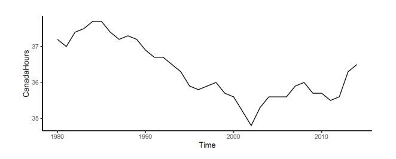
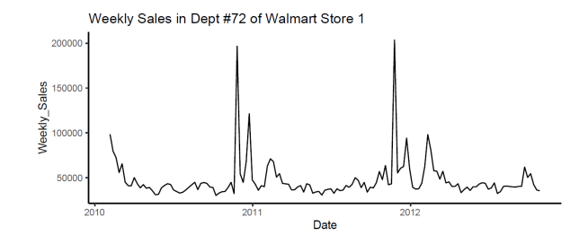

```{r setup, include=FALSE}
knitr::opts_chunk$set(echo = TRUE)

defaultW <- getOption("warn") 

options(warn = -1) 
```

# ADS 506 Module 4 Exercises: Chapter 7

This assignment is due on Day 7 of the learning week. The assignment for this module is a mixture of programming and written work. Complete this entire assignment in R Markdown. You will need to include the question and number that you are answering within your submitted assignment. Once completed, you will knit your deliverable to a Word/PDF file.

## Chapter 7: Regression Models: Autocorrelation & External Info (Pages 170-178): #1, 2, & 6

1.  Analysis of Canadian Manufacturing Workers Work-Hours: The time series plot in Figure 7.7 describes the average annual number of weekly hours spent by Canadian manufacturing workers. The data is available in CanadianWorkHours.csv.



```{r get data and plot, message=FALSE, warning=FALSE}
library(fpp2)
library(zoo)
library(readr)
library(dplyr)

set.seed(506)

CanadianWorkHours <- read_csv("Data/CanadianWorkHours.csv", show_col_types = FALSE)


cwh.ts <- ts(CanadianWorkHours$Hrs_per_Wk, frequency = 1)

autoplot(cwh.ts) +
  theme_classic() +
  labs(x = "Time",
     y = "CanadaHours") 
```

a.  If we computed the autocorrelation of this series, would the lag-1 autocorrelation exhibit negative, positive, or no autocorrelation? How can you see this from the plot?

**Answer** I would say that we would see positive autocorrelation. We can see this because there is trending in the data. If something is going down, it continues to follow that trend.

b.  Compute the autocorrelation and produce an ACF plot. Verify your answer to the previous question.

```{r cwh.ts acf}
acf(cwh.ts)
```

**Answer** The chart above shows us that we do have positive autocorrelation.


\newpage

2.  Forecasting Walmart Stock: Figure 7.10 shows a time plot of Wal-Mart daily closing prices between February 2001 and February 2002. The data is available at finance.yahoo.com and in WalmartStock.csv. The ACF plots of these daily closing prices and its lag-1 differenced series are in Figure 7.11. Table 7.4 shows the output from fitting an AR(1) model to the series of closing prices and to the series of differences. Use all the information to answer the following questions.

```{r get walmart data, message=FALSE, warning=FALSE}

WalmartStock <- read_csv("Data/WalmartStock.csv", 
    col_types = cols(Date = col_date(format = "%m/%d/%Y")), 
    show_col_types = FALSE)

wsc.ts <- ts(WalmartStock$Close, frequency = 1)

autoplot(wsc.ts) +
  theme_classic() +
  labs(x = "Time",
     y = "Close Price ($)") 

acf(wsc.ts)
acf(diff(wsc.ts))

```

a.  Create a time plot of the differenced series.

```{r}
autoplot(diff(wsc.ts)) +
  theme_classic() +
  labs(x = "Time",
     y = "Difference Series") 
```

b.  Which of the following is/are relevant for testing whether this stock is a random walk?

-   [ ] The autocorrelations of the closing price series.
-   [X] The AR(1) slope coefficient for the closing price series.
-   [ ] The AR(1) constant coefficient for the closing price series.
-   [X] The autocorrelations of the differenced series.
-   [ ] The AR(1) slope coefficient for the differenced series. - The AR(1) constant coefficient for the differenced series.

c.  Recreate the AR(1) model output for the Close price series shown in the left panel of Table 7.4. Does the AR model indicate that this is a random walk? Explain how you reached your conclusion.

**Answer** The slope coefficient is not 1, it is statistically smaller at -0.0483 it is 16 standard deviations away from 1. Suggesting that this is not a random walk.

```{r}
# our arima model
my_arima <- arima(wsc.ts, order = c(1, 0, 0))
summary(my_arima)
```


d.  What are the implications of finding that a time series is a random walk? Choose the correct statement(s) below:

-   [X] It is impossible to obtain useful forecasts of the series.
-   [X] The series is random.
-   [X] The changes in the series from one period to the other are random.


\newpage

6.  Forecasting Weekly Sales at Walmart: The data in WalmartStore1Dept72.csv is a subset from a larger datasets on weekly department-wise sales at 45 Walmart stores, which were released by Walmart as part of a hiring contest hosted on kaggle.com. The file includes data on a single department at one specific store.



The fields include:

-   Date - the week -

-   Weekly_Sales - sales for the given department in the given store

-   IsHoliday - whether the week is a special holiday week

-   Temperature - average temperature in the region

-   Fuel_Price - cost of fuel in the region

-   MarkDown1-5 - anonymized data related to promotional markdowns that Walmart is running. MarkDown data is only available after Nov 2011, and is not available for all stores all the time.

-   CPI - the consumer price index

-   Unemployment - the unemployment rate

Figure 7.15 shows a time plot of weekly sales in this department. We are interested in creating a forecasting model for weekly sales for the next 26 weeks.

```{r}
WalmartStore1Dept72 <- read_csv("Data/WalmartStore1Dept72.csv", 
                                col_types = cols(Date = col_date(format = "%m/%d/%Y"), 
                                                 IsHoliday = col_logical()), 
                                show_col_types = FALSE)


wsd72.ts <- ts(WalmartStore1Dept72$Weekly_Sales, start = c(2010, 5), frequency = 52)
```


a.  Recreate the time plot of the weekly sales data. Which systematic patterns appear in this series?
**Answer** I see annual patterns where sales appear greatest around November, December, and February.

```{r}
# visualize the data to see if there is seasonality, trending or cycles.
autoplot(wsd72.ts) +
  theme_classic() +
  labs(x = "Date",
     y = "Weekly Sales") 
```


b.  Create time plots of the other numerical series (Temperature, Fuel_Price, CPI, and Unemployment). Also create scatter plots of the sales series against each of these four series (each point in the scatter plot will be a week). From the charts, which of the four series would potentially be useful as external predictors in a regression model for forecasting sales?

**Answer** I think Temperature and maybe Fuel_Price will useful external predictor in a regression model.


```{r}

temp_wsd72.ts <- ts(WalmartStore1Dept72$Temperature, start = c(2010, 5), frequency = 52)
fp_wsd72.ts <- ts(WalmartStore1Dept72$Fuel_Price, start = c(2010, 5), frequency = 52)
cpi_wsd72.ts <- ts(WalmartStore1Dept72$CPI, start = c(2010, 5), frequency = 52)
unemp_wsd72.ts <- ts(WalmartStore1Dept72$Unemployment, start = c(2010, 5), frequency = 52)

autoplot(temp_wsd72.ts) +
  theme_classic() +
  labs(x = "Date",
     y = "Temperature") 

autoplot(fp_wsd72.ts) +
  theme_classic() +
  labs(x = "Date",
     y = "Fuel_Price") 

autoplot(cpi_wsd72.ts) +
  theme_classic() +
  labs(x = "Date",
     y = "CPI") 

autoplot(unemp_wsd72.ts) +
  theme_classic() +
  labs(x = "Date",
     y = "Unemployment") 


plot(WalmartStore1Dept72$Weekly_Sales,WalmartStore1Dept72$Temperature)
plot(WalmartStore1Dept72$Weekly_Sales,WalmartStore1Dept72$Fuel_Price)
plot(WalmartStore1Dept72$Weekly_Sales,WalmartStore1Dept72$CPI)
plot(WalmartStore1Dept72$Weekly_Sales,WalmartStore1Dept72$Unemployment)
```


The following questions are not in your textbook. You will need to also complete these programming questions in R Markdown.

c.  Fit an ARIMA model with 1 lag and external predictors for Weekly_Sales that treats Nov 4, 2011 to Oct 26, 2012 as the training period, and the next 26 weeks as the validation period. Compute the RMSE for the training period.

```{r}


training_set <- WalmartStore1Dept72 %>% filter(Date >= as.Date('2011-11-04') & 
                                                 Date <= as.Date('2012-10-26') ) 

outcome_v <- training_set$Weekly_Sales
predictors <- as.matrix(training_set %>% select(Temperature, Fuel_Price, CPI, Unemployment))


my_arima_reg_model <- Arima(outcome_v, order = c(1,0,0), xreg = predictors)
summary(my_arima_reg_model)


# RMSE
sqrt(mean(my_arima_reg_model$residuals^2))

```


d.  Create a mean forecasts for the validation period. Create a time plot of these forecasts and a plot of the forecast errors series. Compute the RMSE for the training period.

**Answer** I'm assuming you really meant training period rather than validation period because we have no actual values to compare to in the validation set.
```{r}
# Mean Forecast
mf <- mean(training_set$Weekly_Sales)

# RMSE of Mean Forecast
sqrt(mean((training_set %>% mutate(resids = Weekly_Sales - mf) %>% pull(resids))^2))


training_set %>% mutate(Residuals = Weekly_Sales - mf,
                        Mean_Forecast = mf) %>% 
  ggplot(aes(x=Date)) +
  geom_line(aes(y=Residuals)) +   
  geom_line(aes(y=Mean_Forecast))
```


e.  Compare the performance of the ARIMA model to the mean forecasts. Which one performs better?

**Answer** The ARIMA model performs better than the mean model.


```{r}
# RMSE of ARIMA Model Forecast
sqrt(mean(my_arima_reg_model$residuals^2))

# RMSE of Mean Forecast
sqrt(mean((training_set %>% mutate(resids = Weekly_Sales - mf) %>% pull(resids))^2))

```


f.  Plot the ARIMA model forecasted values. Use WalmartStore1Dept72_validation.csv for your regression model data.

**Answer** See below:


```{r}
# forecasting

WalmartStore1Dept72_valid <- read_csv("Data/WalmartStore1Dept72_validation.csv", 
                                      col_types = cols(Date = col_date(format = "%m/%d/%Y"), 
                                                       IsHoliday = col_logical()), 
                                      show_col_types = FALSE)


my_predictors <- as.matrix(WalmartStore1Dept72_valid %>% 
                             select(Temperature, Fuel_Price, CPI, Unemployment))


my_forecast <- forecast(my_arima_reg_model, xreg = my_predictors)

my_forecast

autoplot(ts(training_set$Weekly_Sales), color = 'red') +
  autolayer(my_forecast, alpha = .3) 
```


