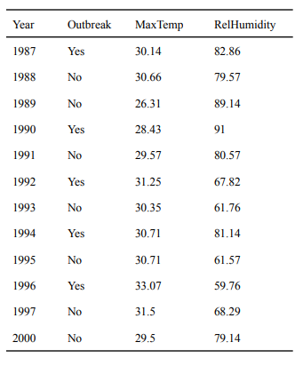

```{r setup, include=FALSE}
knitr::opts_chunk$set(echo = TRUE)

defaultW <- getOption("warn") 

options(warn = -1) 
```

# ADS 506 Module 5 Exercises: Chapter 8

This assignment is due on Day 7 of the learning week. The assignment for this module is a mixture of programming and written work. Complete this entire assignment in R Markdown. You will need to include the question and number that you are answering within your submitted assignment. **Once completed, you will knit your deliverable to a Word/PDF file.**

## Chapter 8: Forecasting Binary Outcomes (Pages 187-188): #4-7

For predicting whether the agricultural epidemic of powdery mildew in mango will erupt in a certain year in the state of Uttar Pradesh in India, Misra et al. (2004) records during 1987-2000. The epidemic typically occurs in the third and fourth week of March, and hence outbreak status is known by the end of March of a given year. The authors used a logistic regression model with two weather predictors (maximum temperature and relative humidity) to forecast an outbreak. The data is shown in the table below and are available in PowderyMildewEpidemic.csv, located in your assignment prompt in Blackboard.


```{r get data and plot, message=FALSE, warning=FALSE}
library(fpp2)
library(zoo)
library(readr)
library(dplyr)
library(caret) # For the confusion Matrix

set.seed(506)

PowderyMildewEpidemic <- read_csv("Data/PowderyMildewEpidemic.csv", show_col_types= FALSE)

```


4\. Compute naive forecasts of epidemic status for years 1995-1997 using next-year forecasts $(F_{t-1} = F_t )$. What is the naive forecast for the year 2000? Summarize the results for these four years in a classification matrix.

**Answer** The naive forecast for year 2000 is the value from the previous observation 1997, which is "No". See classification matrix below.

```{r}

naive_fcst <- PowderyMildewEpidemic %>%
  mutate(lag = lag(Outbreak , 1)) %>% 
  filter(Year >= 1995)

confusionMatrix(as.factor(naive_fcst$Outbreak), as.factor(naive_fcst$lag))


```


5\. Partition the data into training and validation periods, so that years 1987-1994 are the training period. Fit a logistic regression to the training period using the two predictors and report the outbreak probability as well as a forecast for year 1995 (use a threshold of 0.5).

**Answer** The outbreak probability for the year 1995 is 0.1119407 and the forecast is "No" using the threshold of 0.5. See code below.

```{r}


train <- PowderyMildewEpidemic %>% 
  mutate(y_Outbreak = ifelse(Outbreak == 'Yes', 1, 0)) %>%
  filter(Year <= 1994)

test <- PowderyMildewEpidemic %>% 
  mutate(y_Outbreak = ifelse(Outbreak == 'Yes', 1, 0)) %>%
  filter(Year == 1995)

logit.model <- glm(y_Outbreak ~ MaxTemp + RelHumidity, train,
                   family = "binomial")

logit_pred <- predict(logit.model, newdata = test, type = "response")
logit_pred

```


6\. Generate outbreak forecasts for years 1996, 1997 and 2000 by repeatedly moving the training period forward. For example, to forecast year 1996, partition the data so that years 1987-1995 are the training period. Then fit the logistic regression model and use it to generate a forecast (use threshold 0.5).

**Answer** The forecast for 1996, 1997 and 2000 are "Yes","Yes",and "No" respectively. See code below.


```{r}

# 1996
train <- PowderyMildewEpidemic %>% 
  mutate(y_Outbreak = ifelse(Outbreak == 'Yes', 1, 0)) %>%
  filter(Year <= 1995)

test <- PowderyMildewEpidemic %>% 
  mutate(y_Outbreak = ifelse(Outbreak == 'Yes', 1, 0)) %>%
  filter(Year == 1996)

logit.model <- glm(y_Outbreak ~ MaxTemp + RelHumidity, train,
                   family = "binomial")

logit_pred_1996 <- predict(logit.model, newdata = test, type = "response")
logit_pred_1996


###########################################################################


# 1997
train <- PowderyMildewEpidemic %>% 
  mutate(y_Outbreak = ifelse(Outbreak == 'Yes', 1, 0)) %>%
  filter(Year <= 1996)

test <- PowderyMildewEpidemic %>% 
  mutate(y_Outbreak = ifelse(Outbreak == 'Yes', 1, 0)) %>%
  filter(Year == 1997)

logit.model <- glm(y_Outbreak ~ MaxTemp + RelHumidity, train,
                   family = "binomial")

logit_pred_1997 <- predict(logit.model, newdata = test, type = "response")
logit_pred_1997


###########################################################################

# 2000
train <- PowderyMildewEpidemic %>% 
  mutate(y_Outbreak = ifelse(Outbreak == 'Yes', 1, 0)) %>%
  filter(Year <= 1999)

test <- PowderyMildewEpidemic %>% 
  mutate(y_Outbreak = ifelse(Outbreak == 'Yes', 1, 0)) %>%
  filter(Year == 2000)

logit.model <- glm(y_Outbreak ~ MaxTemp + RelHumidity, train,
                   family = "binomial")

logit_pred_2000 <- predict(logit.model, newdata = test, type = "response")
logit_pred_2000

```


7\. Summarize the logistic regression\'s predictive accuracy for these four years (1995-1997, 2000) in a classification matrix.

**Answer** See classification matrix below code below.


```{r}

confusionMatrix(as.factor(c("No", "Yes", "Yes","No")),as.factor(c("No","Yes","No","No")), positive = "Yes")

```


